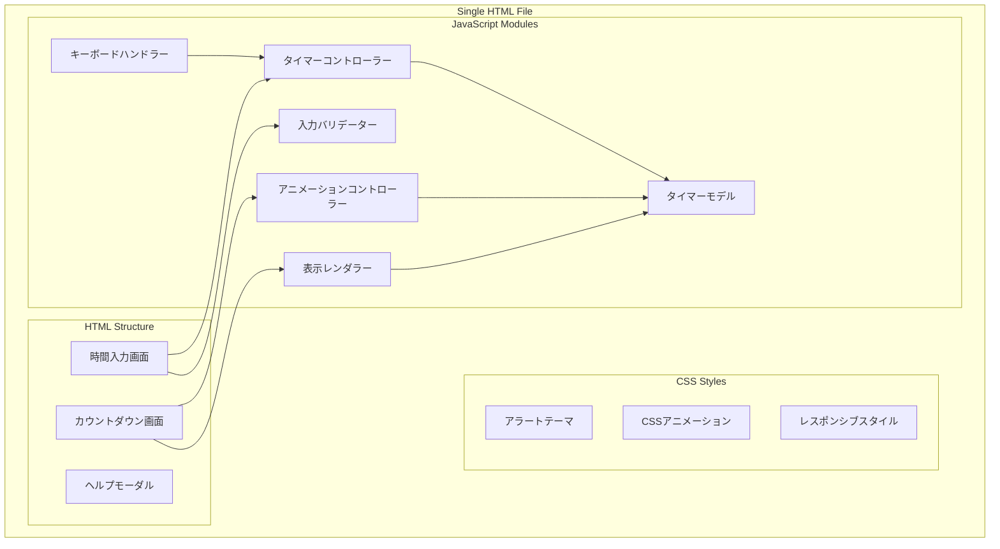
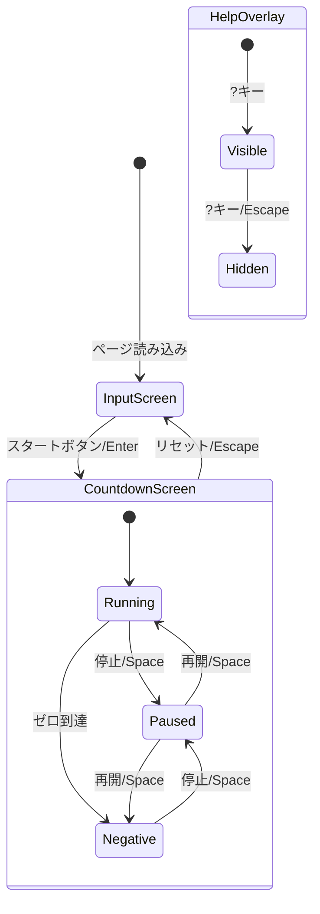

# 設計ドキュメント

## 概要

本設計ドキュメントは、ブラウザで動作するHTML+JavaScript製のアラート風カウントダウンタイマーの技術設計を定義します。単一のHTMLファイルで完結する構成とし、外部依存なしでモダンブラウザで動作するWebアプリケーションとして実装します。

### 技術スタック

- **構成**: 単一HTMLファイル（CSS、JavaScript埋め込み）
- **言語**: HTML5、CSS3、ES6+ JavaScript
- **外部依存**: なし（CDN、ライブラリ不要）
- **対象ブラウザ**: Chrome、Firefox、Safari、Edge（最新版）

### 設計方針

1. **シンプルな構成**: 単一HTMLファイルで完結し、配布・利用が容易
2. **モジュラー設計**: JavaScript内でModel-View-Controller的な責務分離
3. **レスポンシブ対応**: ウィンドウサイズに応じた表示スケーリング
4. **パフォーマンス**: requestAnimationFrameによる滑らかなアニメーション

## アーキテクチャ

### システム構成図



### 画面遷移図



## コンポーネントとインターフェース

### HTMLファイル構成

```
countdown-timer.html
├── <!DOCTYPE html>
├── <head>
│   ├── <meta charset, viewport>
│   ├── <title>
│   └── <style>
│       ├── CSS Variables (テーマカラー)
│       ├── Base Styles (リセット、フォント)
│       ├── Input Screen Styles
│       ├── Countdown Screen Styles
│       ├── Animation Keyframes
│       └── Responsive Styles
└── <body>
    ├── <div id="input-screen">
    │   ├── 分入力フィールド
    │   ├── 秒入力フィールド
    │   ├── エラーメッセージ
    │   └── スタートボタン
    ├── <div id="countdown-screen">
    │   ├── タイマー表示
    │   └── コントロールボタン
    ├── <div id="help-modal">
    │   └── ショートカット一覧
    └── <script>
        ├── TimerModel クラス
        ├── TimerController クラス
        ├── InputValidator クラス
        ├── DisplayRenderer クラス
        ├── AnimationController クラス
        ├── KeyboardHandler クラス
        └── 初期化コード
```

### 主要クラス・インターフェース

```javascript
/**
 * タイマーの状態を保持するモデル
 */
class TimerModel {
    constructor() {
        this.initialSeconds = 0;      // 初期設定秒数
        this.remainingMs = 0;         // 残りミリ秒（負の値も可）
        this.status = 'idle';         // 'idle' | 'running' | 'paused'
        this.lastTickTime = null;     // 最後のティック時刻
    }
    
    /** 残り秒数を取得（負の値も可） */
    getRemainingSeconds() { }
    
    /** 超過状態かを判定 */
    isNegative() { }
    
    /** 実行中かを判定 */
    isRunning() { }
    
    /** 一時停止中かを判定 */
    isPaused() { }
}

/**
 * タイマーの制御を行うコントローラー
 */
class TimerController {
    constructor(model, onUpdate) { }
    
    /** 指定秒数でカウントダウンを開始 */
    start(seconds) { }
    
    /** カウントダウンを一時停止 */
    pause() { }
    
    /** カウントダウンを再開 */
    resume() { }
    
    /** タイマーをリセット */
    reset() { }
    
    /** 一時停止/再開を切り替え */
    toggle() { }
}

/**
 * 時間入力の検証を行うバリデーター
 */
class InputValidator {
    /** 分の入力値を検証 */
    validateMinutes(value) { }
    
    /** 秒の入力値を検証 */
    validateSeconds(value) { }
    
    /** 合計時間が有効範囲内かを検証 */
    validateTotal(minutes, seconds) { }
}

/**
 * 表示の更新を行うレンダラー
 */
class DisplayRenderer {
    constructor(elements) { }
    
    /** タイマー表示を更新 */
    updateDisplay(model) { }
    
    /** 画面を切り替え */
    showScreen(screenName) { }
    
    /** エラーメッセージを表示 */
    showError(message) { }
}

/**
 * アニメーションを制御するコントローラー
 */
class AnimationController {
    constructor(elements) { }
    
    /** 通常アニメーションを開始 */
    startNormal() { }
    
    /** 点滅アニメーションを開始（残り10秒以下） */
    startBlink() { }
    
    /** 強調アニメーションを開始（超過時） */
    startCritical() { }
    
    /** アニメーションを停止 */
    stop() { }
}

/**
 * キーボード入力を処理するハンドラー
 */
class KeyboardHandler {
    constructor(controller, renderer) { }
    
    /** キーボードイベントを処理 */
    handleKeyDown(event) { }
}
```

## データモデル

### タイマー状態

```javascript
// タイマーの状態定数
const TimerStatus = {
    IDLE: 'idle',       // 待機中（入力画面）
    RUNNING: 'running', // 実行中
    PAUSED: 'paused'    // 一時停止中
};

// タイマーモデルの状態
{
    initialSeconds: number,   // 初期設定秒数（1-5999）
    remainingMs: number,      // 残りミリ秒（負の値も可）
    status: TimerStatus,      // 現在の状態
    lastTickTime: number|null // 最後の更新時刻（performance.now()）
}
```

### 時間フォーマット

| 状態 | 表示形式 | 例 |
|------|----------|-----|
| 正の値 | MM:SS | 05:30 |
| ゼロ | 00:00 | 00:00 |
| 負の値 | -MM:SS | -00:15 |

### 入力値の制約

| フィールド | 最小値 | 最大値 | 備考 |
|------------|--------|--------|------|
| 分 | 0 | 99 | 整数のみ |
| 秒 | 0 | 59 | 整数のみ |
| 合計 | 1秒 | 99分59秒 | 0秒は無効 |

### アニメーション状態

| 残り時間 | アニメーション状態 | 視覚効果 |
|----------|-------------------|----------|
| 11秒以上 | normal | 通常の警告表示 |
| 1-10秒 | blink | 点滅アニメーション |
| 0秒以下 | critical | 強調された警告表示 |

