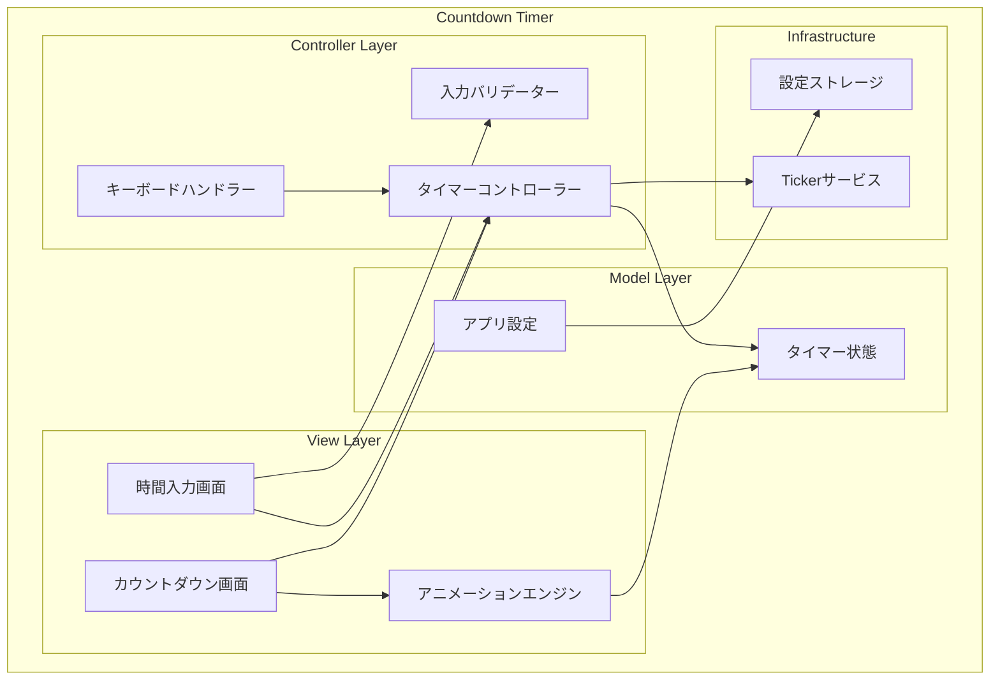
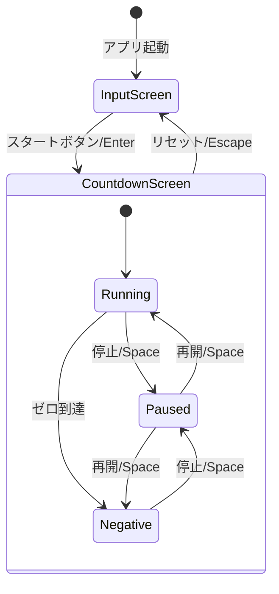

# 設計ドキュメント

## 概要

本設計ドキュメントは、アラート風カウントダウンタイマーのデスクトップアプリケーションの技術設計を定義します。Go言語とGioフレームワークを使用し、cgo不要でmacOSとWindowsの両方で動作するクロスプラットフォームアプリケーションとして、視覚的にインパクトのあるタイマーを実装します。

### 技術スタック

- **言語**: Go 1.21+
- **GUIフレームワーク**: Gio (Pure Go、cgo不要のクロスプラットフォームGUIツールキット)
- **ビルドツール**: Go modules
- **対象OS**: macOS 12.0+, Windows 10+
- **ビルド制約**: `CGO_ENABLED=0` でビルド可能

### 設計方針

1. **シンプルなアーキテクチャ**: MVCパターンを採用し、UI、ロジック、データを明確に分離
2. **リアクティブUI**: タイマー状態の変更を即座にUIに反映
3. **拡張性**: アニメーションやテーマの追加が容易な構造

## アーキテクチャ

### システム構成図



### 画面遷移図



## コンポーネントとインターフェース

### パッケージ構成

```
countdown-timer/
├── main.go                 # エントリーポイント
├── internal/
│   ├── model/
│   │   ├── timer.go        # タイマー状態モデル
│   │   └── config.go       # アプリ設定モデル
│   ├── controller/
│   │   ├── timer.go        # タイマーコントローラー
│   │   └── validator.go    # 入力バリデーター
│   ├── view/
│   │   ├── app.go          # メインアプリケーションウィンドウ
│   │   ├── input.go        # 時間入力画面
│   │   ├── countdown.go    # カウントダウン画面
│   │   └── theme.go        # アラートテーマ
│   └── animation/
│       └── alert.go        # 警告アニメーション
├── assets/
│   └── fonts/              # セグメント表示風フォント
└── go.mod
```

### 主要インターフェース

```go
// TimerState はタイマーの現在状態を表す
type TimerState interface {
    // GetRemainingSeconds は残り秒数を返す（負の値も可）
    GetRemainingSeconds() int
    // GetInitialSeconds は初期設定秒数を返す
    GetInitialSeconds() int
    // IsRunning はタイマーが実行中かを返す
    IsRunning() bool
    // IsPaused はタイマーが一時停止中かを返す
    IsPaused() bool
    // IsNegative は超過状態かを返す
    IsNegative() bool
}

// TimerController はタイマーの制御を行う
type TimerController interface {
    // Start は指定秒数でカウントダウンを開始する
    Start(seconds int) error
    // Stop はカウントダウンを一時停止する
    Stop()
    // Resume はカウントダウンを再開する
    Resume()
    // Reset はタイマーをリセットする
    Reset()
    // Toggle は一時停止/再開を切り替える
    Toggle()
    // OnTick はティックごとのコールバックを設定する
    OnTick(callback func(state TimerState))
}

// InputValidator は時間入力の検証を行う
type InputValidator interface {
    // ValidateMinutes は分の入力値を検証する
    ValidateMinutes(input string) (int, error)
    // ValidateSeconds は秒の入力値を検証する
    ValidateSeconds(input string) (int, error)
    // ValidateTotal は合計時間が有効範囲内かを検証する
    ValidateTotal(minutes, seconds int) error
}

// AnimationController はアニメーションを制御する
type AnimationController interface {
    // StartNormalAnimation は通常の警告アニメーションを開始する
    StartNormalAnimation()
    // StartBlinkAnimation は点滅アニメーションを開始する（残り10秒以下）
    StartBlinkAnimation()
    // StartCriticalAnimation は超過時の強調アニメーションを開始する
    StartCriticalAnimation()
    // StopAnimation はアニメーションを停止する
    StopAnimation()
}
```


## データモデル

### TimerModel

```go
// TimerModel はタイマーの状態を保持する
type TimerModel struct {
    InitialSeconds   int           // 初期設定秒数
    RemainingSeconds int           // 残り秒数（負の値も可）
    Status           TimerStatus   // タイマーの状態
    StartedAt        time.Time     // 開始時刻
    PausedAt         time.Time     // 一時停止時刻
}

// TimerStatus はタイマーの状態を表す列挙型
type TimerStatus int

const (
    StatusIdle    TimerStatus = iota // 待機中
    StatusRunning                     // 実行中
    StatusPaused                      // 一時停止中
)
```

### AppConfig

```go
// AppConfig はアプリケーション設定を保持する
type AppConfig struct {
    AlwaysOnTop     bool    // 常に最前面表示
    WindowWidth     float32 // ウィンドウ幅
    WindowHeight    float32 // ウィンドウ高さ
    LastMinutes     int     // 最後に入力した分
    LastSeconds     int     // 最後に入力した秒
}
```

### 時間フォーマット

| 状態 | 表示形式 | 例 |
|------|----------|-----|
| 正の値 | MM:SS:mm | 05:30:42 |
| ゼロ | 00:00:00 | 00:00:00 |
| 負の値 | -MM:SS:mm | -00:15:73 |

※ mmはミリ秒の上位2桁（00-99）を表示

### ミリ秒アニメーション

アラート風の高速ミリ秒表示を実現するため、以下の仕様でアニメーションを実装します：

- **更新頻度**: 約60fps（16ms間隔）でミリ秒表示を更新
- **表示方式**: 実際のミリ秒ではなく、視覚的な演出として高速でカウントアップ/ダウンする数値を表示
- **実装方法**: Fyneの`canvas.NewAnimation`を使用し、TickerではなくアニメーションAPIで滑らかな更新を実現
- **パフォーマンス**: ミリ秒部分のみを独立したキャンバスで描画し、メインの秒表示への影響を最小化

### 入力値の制約

| フィールド | 最小値 | 最大値 | 備考 |
|------------|--------|--------|------|
| 分 | 0 | 99 | 整数のみ |
| 秒 | 0 | 59 | 整数のみ |
| 合計 | 1秒 | 99分59秒 | 0秒は無効 |

## 正確性プロパティ

*プロパティとは、システムのすべての有効な実行において真であるべき特性または動作です。プロパティは、人間が読める仕様と機械で検証可能な正確性保証の橋渡しをします。*

### Property 1: 入力バリデーションの正確性

*任意の*分（0-99）と秒（0-59）の組み合わせに対して、合計が1秒以上99分59秒以下であれば有効と判定され、それ以外は無効と判定される。

**Validates: Requirements 1.4, 1.5**

### Property 2: 無効入力時のスタートボタン無効化

*任意の*無効な入力状態（空、範囲外、非数値）に対して、スタートボタンは無効化されている。

**Validates: Requirements 2.2**

### Property 3: カウントダウン開始時の初期値設定

*任意の*有効な入力時間（分、秒）に対して、スタート後のタイマーの残り秒数は `分 * 60 + 秒` と等しい。

**Validates: Requirements 2.4**

### Property 4: タイマー状態に基づく更新動作

*任意の*タイマー状態に対して、実行中であれば1秒後に残り秒数が1減少し、一時停止中であれば残り秒数は変化しない。

**Validates: Requirements 3.1, 3.5**

### Property 5: 停止・再開のラウンドトリップ

*任意の*実行中のタイマーに対して、停止してから再開すると、停止直前の残り秒数からカウントダウンが継続される。

**Validates: Requirements 3.2, 3.3**

### Property 6: ゼロ到達後のマイナス継続

*任意の*カウントダウンに対して、ゼロに到達した後も停止せず、1秒後に残り秒数が-1になる。

**Validates: Requirements 4.1**

### Property 7: 負の値の表示フォーマット

*任意の*負の秒数に対して、フォーマット結果は `-MM:SS:mm` 形式であり、`-` プレフィックスが付き、分と秒は絶対値から計算される。

**Validates: Requirements 4.2**

### Property 8: ミリ秒アニメーションの更新頻度

*任意の*実行中のタイマーに対して、ミリ秒表示は約60fps（16ms±5ms間隔）で更新される。

**Validates: Requirements 5.3**

### Property 9: アニメーション状態の閾値遷移

*任意の*残り秒数に対して、10秒超なら通常アニメーション、1-10秒なら点滅アニメーション、0秒以下なら強調アニメーション状態になる。

**Validates: Requirements 5.4, 5.5**

### Property 10: スペースキーによる状態トグル

*任意の*カウントダウン画面の状態（実行中または一時停止中）に対して、スペースキーを押すと状態が反転する（実行中→一時停止、一時停止→実行中）。

**Validates: Requirements 7.2**


## エラーハンドリング

### 入力エラー

| エラー種別 | 条件 | 対応 |
|------------|------|------|
| 空入力 | 分または秒が空 | エラーメッセージ表示、スタートボタン無効化 |
| 非数値入力 | 数値以外の文字が含まれる | エラーメッセージ表示、入力拒否 |
| 範囲外（分） | 分が0未満または99超 | エラーメッセージ表示、入力拒否 |
| 範囲外（秒） | 秒が0未満または59超 | エラーメッセージ表示、入力拒否 |
| ゼロ時間 | 合計が0秒 | エラーメッセージ表示、スタートボタン無効化 |

### システムエラー

| エラー種別 | 条件 | 対応 |
|------------|------|------|
| フォントロード失敗 | フォントファイル欠損 | システムフォントにフォールバック |

### エラーメッセージ

```go
var (
    ErrEmptyInput     = errors.New("時間を入力してください")
    ErrInvalidMinutes = errors.New("分は0〜99の範囲で入力してください")
    ErrInvalidSeconds = errors.New("秒は0〜59の範囲で入力してください")
    ErrZeroTime       = errors.New("1秒以上の時間を入力してください")
    ErrInvalidFormat  = errors.New("数値を入力してください")
)
```

## テスト戦略

### テストアプローチ

本プロジェクトでは、ユニットテストとプロパティベーステストの両方を採用します。

- **ユニットテスト**: 特定の例、エッジケース、エラー条件の検証
- **プロパティベーステスト**: すべての入力に対して成り立つ普遍的なプロパティの検証

### プロパティベーステストライブラリ

Go言語では `github.com/leanovate/gopter` を使用します。

### テスト構成

```
countdown-timer/
├── internal/
│   ├── model/
│   │   └── timer_test.go       # タイマーモデルのテスト
│   ├── controller/
│   │   ├── timer_test.go       # タイマーコントローラーのテスト
│   │   └── validator_test.go   # バリデーターのテスト
│   └── animation/
│       └── alert_test.go       # アニメーション状態のテスト
```

### プロパティベーステスト設定

- 各プロパティテストは最低100回のイテレーションを実行
- 各テストは設計ドキュメントのプロパティを参照するタグを含む
- タグ形式: `Feature: countdown-timer, Property {number}: {property_text}`

### テスト例

```go
// Feature: countdown-timer, Property 1: 入力バリデーションの正確性
func TestValidation_Property1(t *testing.T) {
    properties := gopter.NewProperties(gopter.DefaultTestParameters())
    
    properties.Property("valid input range is accepted", prop.ForAll(
        func(minutes, seconds int) bool {
            validator := NewInputValidator()
            total := minutes*60 + seconds
            err := validator.ValidateTotal(minutes, seconds)
            
            isValidRange := minutes >= 0 && minutes <= 99 &&
                           seconds >= 0 && seconds <= 59 &&
                           total >= 1 && total <= 5999
            
            return (err == nil) == isValidRange
        },
        gen.IntRange(0, 100),
        gen.IntRange(0, 60),
    ))
    
    properties.TestingRun(t)
}

// Feature: countdown-timer, Property 7: 負の値の表示フォーマット
func TestFormat_Property7(t *testing.T) {
    properties := gopter.NewProperties(gopter.DefaultTestParameters())
    
    properties.Property("negative seconds format correctly", prop.ForAll(
        func(seconds int) bool {
            formatted := FormatTime(-seconds)
            
            if seconds <= 0 {
                return true // 正の値は対象外
            }
            
            expectedMins := seconds / 60
            expectedSecs := seconds % 60
            expected := fmt.Sprintf("-%02d:%02d", expectedMins, expectedSecs)
            
            return formatted == expected
        },
        gen.IntRange(1, 6000),
    ))
    
    properties.TestingRun(t)
}

```

### ユニットテスト例

```go
// エッジケース: 無効な入力形式
func TestValidation_InvalidFormat(t *testing.T) {
    validator := NewInputValidator()
    
    testCases := []struct {
        name  string
        input string
    }{
        {"empty string", ""},
        {"letters", "abc"},
        {"special chars", "!@#"},
        {"decimal", "1.5"},
        {"negative", "-5"},
    }
    
    for _, tc := range testCases {
        t.Run(tc.name, func(t *testing.T) {
            _, err := validator.ValidateMinutes(tc.input)
            if err == nil {
                t.Errorf("expected error for input %q", tc.input)
            }
        })
    }
}

// 例: アプリ起動時に入力画面が表示される
func TestApp_InitialScreen(t *testing.T) {
    app := NewApp()
    
    if app.CurrentScreen() != ScreenInput {
        t.Error("expected input screen on startup")
    }
}
```

